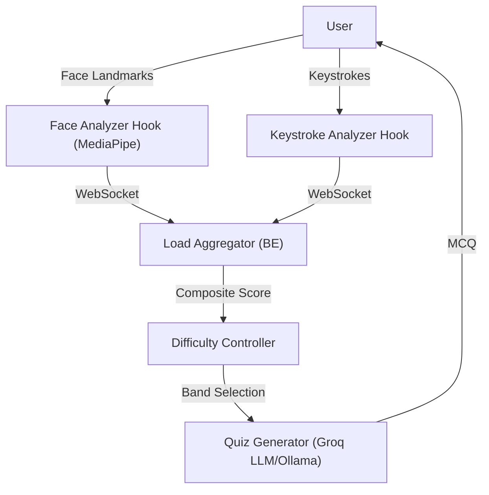

# Cognitive Load Balancer (CLB) - Detailed Project Explanation

## 1. Introduction and Core Concept

The **Cognitive Load Balancer (CLB)** is an advanced, real-time adaptive learning system designed to estimate a learner's cognitive load using passive bio-behavioral telemetry. By analyzing localized, passive signals such as typing rhythms and facial tension during a study session, the system continuously scales the difficulty of study materials—like customized quizzes—to maintain the user in an optimal "Flow State" (the precise balance between boredom and frustration).

Originally designed as an offline-first architecture prioritizing privacy (where telemetry and processing stay local), the system integrates powerful Large Language Models (LLMs) to dynamically generate contextually relevant, chunk-grounded Multiple Choice Questions (MCQs) from user-uploaded documents (e.g., PDFs).

## 2. Core Architecture

The CLB utilizes a decoupled, modern web architecture with a high-performance backend and a reactive frontend.

- **Frontend**: Built with React 18, TypeScript, and Vite. It serves as both the User Interface and the primary telemetry collection engine using browser-accessible APIs.
- **Backend**: Built with Python 3.11+ and FastAPI. It orchestrates signal aggregation, contextual memory management, and generative AI orchestration.
- **Communication Protocol**: Standard REST APIs are used for document uploads and session configuration, while low-latency **WebSockets** are utilized for high-frequency signal telemetry.



## 3. Telemetry and Signal Processing

To gauge the learner's cognitive state without intrusive equipment, the CLB uses **Edge Signal Processing**, running real-time metric capture directly in the user's browser.

### 3.1. Keystroke Analysis
Captures typing behavior directly within the application's input fields (such as typed answers to MCQs).
- **Inter-Keystroke Interval (IKI) Variance**: Erratic typing patterns heavily correlate with confusion or high cognitive load.
- **Words Per Minute (WPM) & Backspace Rate**: Frustration often manifests as a massive drop in typing speed and an elevated deletion (backspace) rate.

### 3.2. Facial Analysis
Uses **MediaPipe Face Mesh** within the browser to securely track 3D landmarks without sending image data over the network.
- **Eye Aspect Ratio (EAR)**: Computes blink metrics. Serious deviations from resting blink rates indicate stress or cognitive fatigue.
- **Brow Furrow**: Measures horizontal contraction of inner eyebrows. A primary indicator of intense concentration, confusion, or mental strain.
- **Iris Tracking (Optional)**: Proxies for pupil dilation (Mydriasis), indicating changes in autonomic arousal.

*Note: The system captures a 5-second resting baseline per session to normalize variations in individual user baselines.*

## 4. Backend Orchestration and Load Scoring

When signals hit the backend via WebSockets, the **Load Aggregator** translates them into a cohesive cognitive metric. 

### 4.1. The Composite Load Score
The system merges incoming metrics into a 0 to 100 Composite Load Score using assigned weights:
- **Keystrokes**: 50%
- **Facial Signals**: 35%
- **Response Latency (Answer Timing)**: 15%

If a signal (like webcam access) is missing, weights dynamically renormalize to maintain score coherence. To prevent jittery, rapid difficulty fluctuations, the score is smoothed via an **Exponentially Weighted Moving Average (EWMA)**.

### 4.2. Cognitive Difficulty Bands
The composite score seamlessly maps to five psychological states:
- **FLOW (0-25)**: The ultra-learning state. User has mastered the current difficulty.
- **OPTIMAL (26-50)**: Steady progress. Standard difficulty.
- **ELEVATED (51-75)**: Increasing effort required. System might slightly decrease prompt complexity.
- **OVERLOADED (76-90)**: Approaching cognitive fatigue. Triggers simplification or hints.
- **CRISIS (91-100)**: High stress or complete block. Prompts significant simplification or a required session pause.

## 5. Memory Management and Generative AI

To ensure accurate, relevant question generation without hallucinations, the system relies on vector-grounded memory.

### 5.1. Context and Chunking
Uploaded PDFs are processed via `LlamaIndex` and `sentence-transformers`, chunked into manageable semantic units, and stored in a local **ChromaDB** instance. 
During inference, the LLM only observes one specific text chunk at a time. This guarantees that generated MCQs are grounded entirely in the uploaded document rather than general model knowledge.

### 5.2. Adaptive Question Generation
CLB queries an LLM generator (historically local via Ollama, or high-speed cloud inference via Groq). The prompt explicitly includes the current "Difficulty Band". For example, if the band is **OVERLOADED**, the LLM is instructed to generate a fundamental, easy-to-grasp question about the current text chunk. If the band is **FLOW**, it generates highly complex, multi-concept synthesis questions.

## 6. Learning Pedagogy Integration

- **MCQ with Typed Answer Verification**: Instead of simply clicking "A" or "B", users are required to linearly type their choice. This subtle interaction design ensures the continuous collection of keystroke telemetry while the user interacts with the quiz interface.
- **Spaced Repetition (FSRS)**: Tracks question and topic mastery. Correctly answered concepts are pushed further into the future for review, while struggled concepts (or concepts answered during a "Crisis" state) trigger sooner reviews to reinforce weak knowledge pathways.

## 7. Technology Stack Overview

**Backend:**
- Python 3.11+
- FastAPI (REST & WebSockets)
- SQLAlchemy + SQLite (Telemetry & Session storing)
- ChromaDB (Local Vector DB)
- LlamaIndex (Document Parsing / Chunking)
- LLM Inference: Groq API (Llama3/Phi3) or Ollama (Local)

**Frontend:**
- React 18 & TypeScript
- Vite Bundler
- Tailwind CSS (Styling)
- Recharts / D3 (Visualizing cognitive loads and signal telemetry)
- MediaPipe (Browser-based ML Face Mesh tracking)

## 8. General Project Structure

```text
CognitiveLoadBalancer/
├── backend/
│   ├── api/                   # FastAPI endpoints (document, session, websocket routers)
│   ├── core/                  # Core logic: Aggregator, Difficulty Controller, Chunk Manager
│   ├── data/                  # SQLite databases, Vectors (ChromaDB), Uploads
│   ├── db/                    # SQLAlchemy Schema and Models
│   └── main.py                # Server Entrypoint
├── frontend/
│   ├── src/
│   │   ├── components/        # UI components (QuizPanel, LoadGauge, CalibrationModal, etc.)
│   │   ├── context/           # React Context (e.g., WebSocket Global State)
│   │   ├── hooks/             # Telemetry hooks (useKeystrokeAnalyzer, useFaceAnalyzer)
│   │   └── pages/             # Layout views (SessionPage, SetupPage, ReportPage)
├── scripts/                   # Environment bootstrap/setup shell scripts
└── README.md                  # Project Quickstart Guide
```

## Summary
The Cognitive Load Balancer represents a modern intersection of Physiological Computing and Ed-Tech. By transforming a straightforward quiz application into a bio-responsive learning laboratory, it empirically measures user struggle and success to guarantee the most efficient, personalized learning pathway possible.
