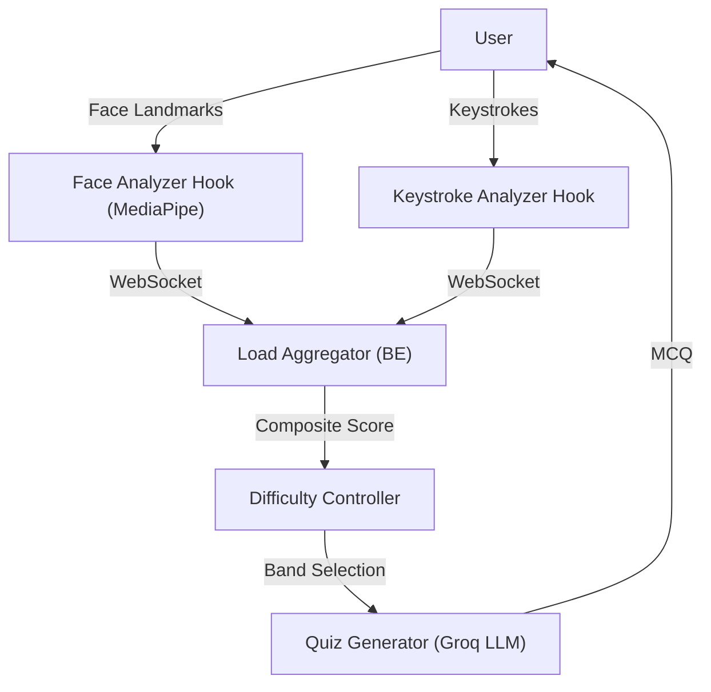

# Cognitive Load Balancer (CLB)

An offline-first adaptive study system that estimates learner cognitive load from passive local signals and adjusts question difficulty in real time.

Documents stay local, inference is handled via the high-speed Groq API, and session telemetry is stored in a local SQLite database.

## 1. Introduction and Core Concept

The Cognitive Load Balancer (CLB) is a real-time adaptive learning laboratory. By analyzing localized, passive signals such as typing rhythms and facial tension during a study session, the system continuously scales the difficulty of study materials to maintain the user in an optimal "Flow State" (the precise balance between boredom and frustration).

### Key Features
- **Local & Private Edge Processing**: The system tracks facial tension and typing behavior to estimate cognitive load, but all telemetry stays completely local. Facial data is processed in-browser and never transmitted to any external server or LLM, ensuring absolute privacy.
- **Chunk-Based Contextual Memory**: Instead of sending entire documents to an LLM, the system securely processes semantic "chunks." Only the highly relevant text chunk is utilized for generating the next question.
- **MCQ for Quick Revision**: Prioritizes Multiple Choice Questions (MCQ) designed as rapid interactive flashcards. This allows users to revise and learn much faster instead of memorizing and typing out long-form answers.

## 2. Core Architecture

The system follows a decoupled architecture using a FastAPI backend and a React/Vite frontend, communicating via REST for configuration and WebSockets for high-frequency signal telemetry.

## 3. Signal Processing Layer

The system uses Edge Signal Processing to minimize server overhead and protect privacy.

### 3.1. Keystroke Analysis
Captures typing behavior directly within the application's input fields.
- Inter-Keystroke Interval (IKI) Variance: Erratic typing patterns heavily correlate with confusion or high cognitive load.
- Words Per Minute (WPM) & Backspace Rate: Frustration often manifests as a massive drop in typing speed and an elevated deletion (backspace) rate.

### 3.2. Facial Analysis
Uses MediaPipe Face Mesh within the browser to securely track 3D landmarks without sending image data over the network.
- Eye Aspect Ratio (EAR): Computes blink metrics. Deviations indicate stress or cognitive fatigue.
- Brow Furrow: Measures horizontal contraction of inner eyebrows. A primary indicator of intense concentration.
- Iris Tracking: Proxies for pupil dilation, indicating changes in autonomic arousal.

Note: The system captures a 5-second resting baseline per session to normalize variations in individual user baselines.

## 4. Backend Orchestration and Load Scoring

### 4.1. The Composite Load Score
The system merges incoming metrics into a 0 to 100 Composite Load Score using assigned weights:
- Keystrokes: 50%
- Facial Signals: 35%
- Response Latency (Answer Timing): 15%

If a signal is missing, weights dynamically renormalize to maintain score coherence. To prevent rapid difficulty fluctuations, the score is smoothed via an Exponentially Weighted Moving Average (EWMA).

### 4.2. Cognitive Difficulty Bands
The composite score seamlessly maps to five psychological states:
- FLOW (0 to 25): The ultra-learning state.
- OPTIMAL (26 to 50): Steady progress. Standard difficulty.
- ELEVATED (51 to 75): Increasing effort required.
- OVERLOADED (76 to 90): Approaching cognitive fatigue.
- CRISIS (91 to 100): High stress or complete block.

## 5. Memory Management and Generative AI

### 5.1. Context and Chunking
Uploaded PDFs are processed via LlamaIndex and sentence-transformers, chunked into manageable semantic units, and stored in a local ChromaDB instance. During inference, the LLM only observes one specific text chunk at a time. This guarantees that generated MCQs are grounded entirely in the uploaded document.

### 5.2. Adaptive Question Generation
CLB queries an LLM generator. The prompt explicitly includes the current "Difficulty Band" to guide the complexity of the generated multiple choice question.

## 6. Learning Pedagogy Integration

- MCQ with Typed Answer Verification: Instead of simply clicking "A" or "B", users are required to linearly type their choice. This ensures the continuous collection of keystroke telemetry.
- Spaced Repetition (FSRS): Tracks question and topic mastery. Correctly answered concepts are pushed further into the future for review.

## 7. Technology Stack Overview

Backend:
- Python 3.11+
- FastAPI (REST & WebSockets)
- SQLAlchemy + SQLite
- ChromaDB (Local Vector DB)
- LlamaIndex
- LLM Inference: Groq API

Frontend:
- React 18 & TypeScript
- Vite Bundler
- Tailwind CSS
- Recharts
- MediaPipe

## 8. General Project Structure

- backend/: Contains API routers, core logic (Aggregator, Difficulty Controller, Chunk Manager), Vector DBs, and SQLite DBs.
- frontend/src/: Contains React components (QuizPanel, LoadGauge), WebSocket contexts, telemetry hooks, and layout pages.
- scripts/: Shell scripts for environment setup.

## 9. Quick Start

### Option A: Automated Setup (recommended)
From repository root, run:
- Git Bash or WSL: `bash scripts/setup.sh`

### Option B: Manual Setup (Windows PowerShell)
From repository root:
1. Backend environment and packages:
   - `cd backend`
   - `if (!(Test-Path .venv)) { python -m venv .venv }`
   - `.\.venv\Scripts\Activate.ps1`
   - `python -m ensurepip --upgrade`
   - `python -m pip install --upgrade pip`
   - `python -m pip install -r requirements.txt`

2. Frontend packages:
   - `cd ..\frontend`
   - `npm install`

## 10. Run the App

Open two terminals from repository root.

Terminal 1 (backend):
- `cd backend`
- `.\.venv\Scripts\Activate.ps1`
- `uvicorn main:app --reload`

Terminal 2 (frontend):
- `cd backend`
- `npm run dev` (from frontend directory)

Open http://localhost:5173

## 11. API Summary

Base URL: http://localhost:8000
WebSocket: ws://localhost:8000/ws/load/{session_id}

Key REST endpoints:
- POST /document/upload (multipart form-data with PDF)
- POST /session/start
- GET /session/report?session_id=...
- POST /signal/keystroke
- POST /signal/face
- GET /question?session_id=...&topic=...
- POST /answer

## 12. Troubleshooting

Python not found in setup script:
- Ensure Python 3.11+ is installed and available in PATH.

Windows venv pip launcher errors:
- Use python module invocation: `python -m pip install --upgrade pip`

Frontend cannot reach backend:
- Verify backend is running on port 8000.
- Verify frontend is running on port 5173.

## 13. Current Scope

Implemented now:
- Keystroke signal collection and posting from frontend
- Composite load scoring and websocket updates
- Document upload and local indexing
- Adaptive question and answer loop
- Session reporting

Planned extension:
- Browser webcam capture path to actively post face signal frames/metrics to POST /signal/face

## License

Add your preferred license file for distribution.
